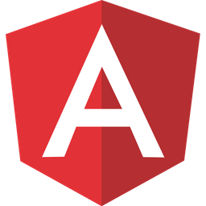

## 👋 Opa, eu sou Lucas Moreira!

<link rel="stylesheet" href="https://cdn.jsdelivr.net/gh/devicons/devicon@v2.13.0/devicon.min.css">

 

  <a href="https://github.com/lmoreira256">
  
  

 
  
  
  
  
  
  
  

##

  
  
  
  
  

  

